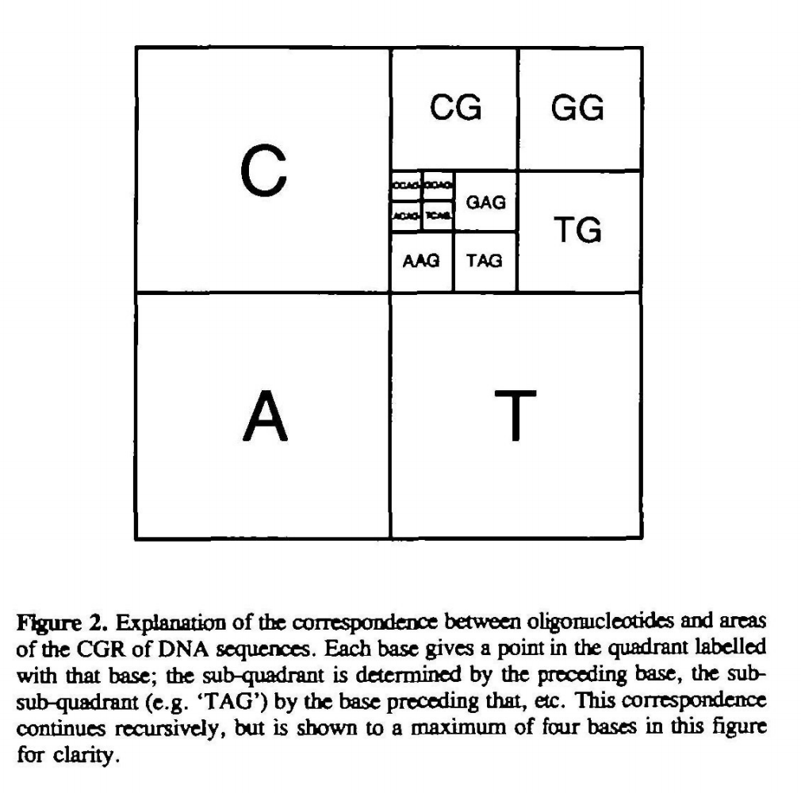

# Chaos Game Representation (CGR)

## Theory

CGR is a way of visualising strings into a scatterplot, with each recursive quadrant of the square represeting different substrings, see below [1].

E.g.



This is an example from a chromosome of *Xestia xanthographa*:


And the mitochondrion from the same species:


For now, plots are output to PNG for speed, however I may try and implement something interactive in JS.


## Usage

As with other Rust projects, you have to complile yourself. <a href="https://www.rust-lang.org/tools/install">Download rust</a>, clone this repo, and then run:

`cargo build --release`

The executable will be at the location `./target/release/cgr`.

```bash
cgr 0.1.0
Max Brown <mb39@sanger.ac.uk>
Make a chaos game representation of a fasta file.

USAGE:
    cgr [OPTIONS] --fasta <fasta>

FLAGS:
    -h, --help       Prints help information
    -V, --version    Prints version information

OPTIONS:
    -f, --fasta <fasta>    The fasta file
    -s, --save <save>      Should the matrix coordinates be saved? Warning: these files can be very large, and take a
                           while to write. [default: false]  [possible values: true, false]
```

[1] Goldman, Nick. "Nucleotide, dinucleotide and trinucleotide frequencies explain patterns observed in chaos game representations of DNA sequences." *Nucleic Acids Research* 21.10 (1993): 2487-2491.